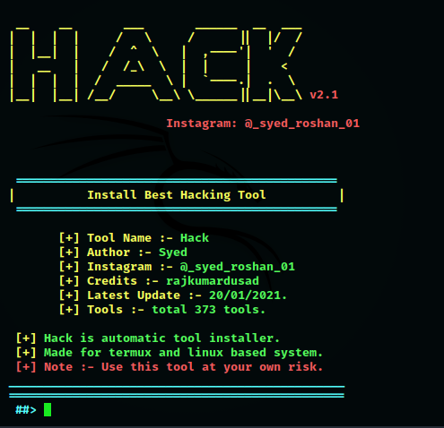
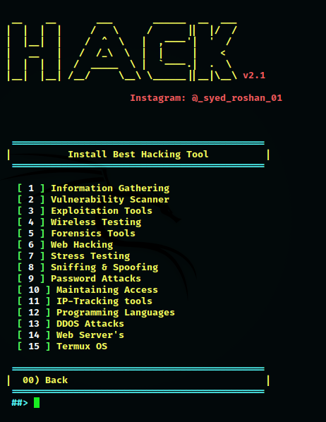
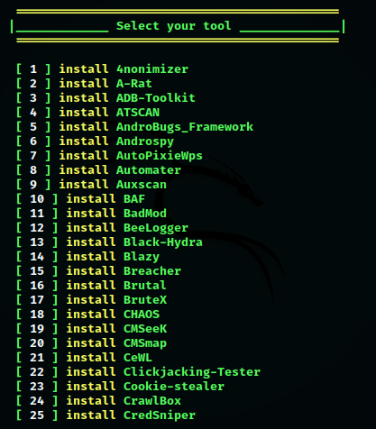

# Hack

------------------------------------------------------------------------

### Introduction

*Hack is a Kali Linux hacking tools installer for Termux and linux system.*
Hack was developed for Termux and linux based systems. Using Hack, you can install almost 370+ hacking tools in Termux (android) and other Linux based distributions. Now Hack is available for Ubuntu, Debian etc.

 

------------------------------------------------------------------------

### Operating System Requirements

Hack works on any of the following operating systems: 
• **Android** (Using the Termux App)  
• **Linux** (Debian Based Systems)  
• **Unix**

------------------------------------------------------------------------

### How to Install

Open the terminal and type following commands.

* `apt update`

* `apt install git`

* `git clone https://github.com/syed-roshan01/Hack.git`

* `cd Hack`

* `chmod +x install`

* `sh install` if not work than use `./install`

------------------------------------------------------------------------

### How to Use ?

Enter a Number for a specific output:
- (1) : To show all available tools and type the number of a tool which you want to install.
- (2) : To show tools category.
- (3) : If you want to update Hack.
- (4) : If you want to know About Us.
- (x) : To exit the tool.

 

Type `Hack` or `hack` from anywhere in your terminal to open Hack.

------------------------------------------------------------------------

### FOLLOW ON INSTAGRAM

* @_syed_roshan_01

------------------------------------------------------------------------

**Warning**

We are not responsible for any misuse or damage caused by this program. use this tool at your own risk!

------------------------------------------------------------------------

* Credits

https://github.com/rajkumardusad

